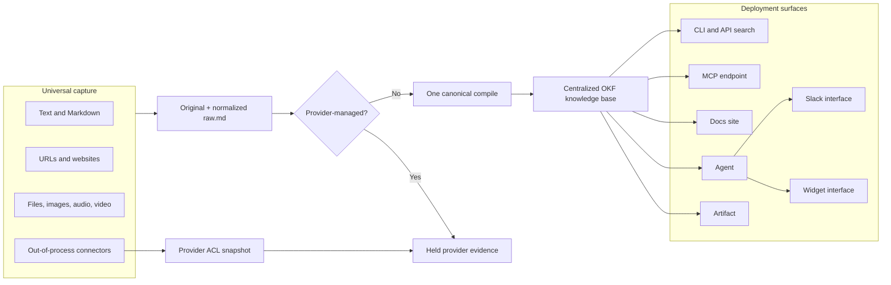
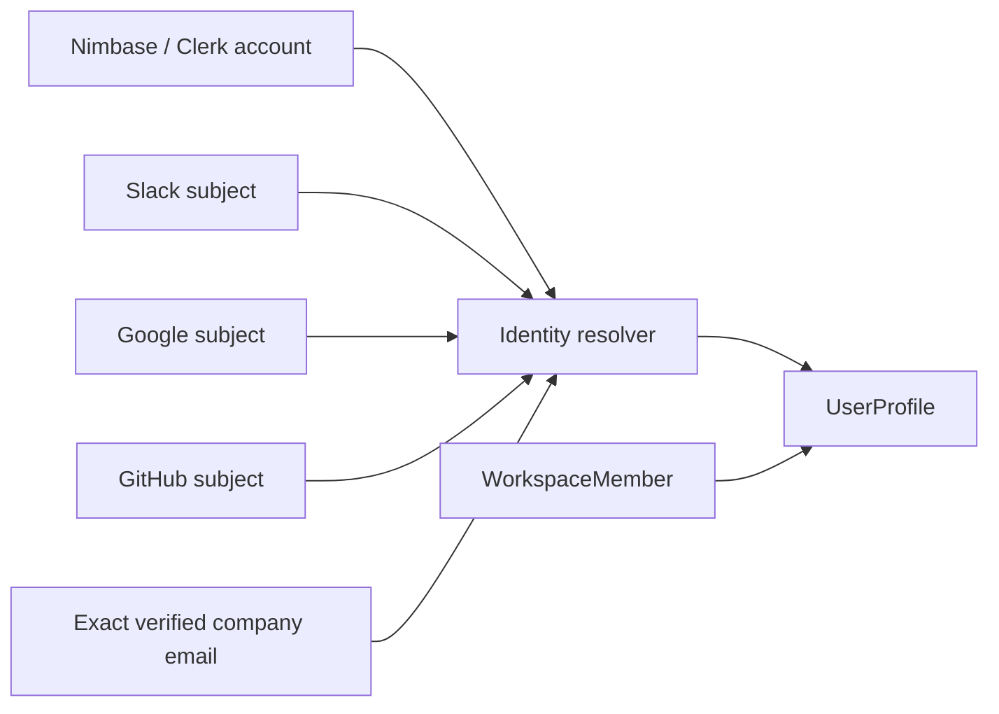
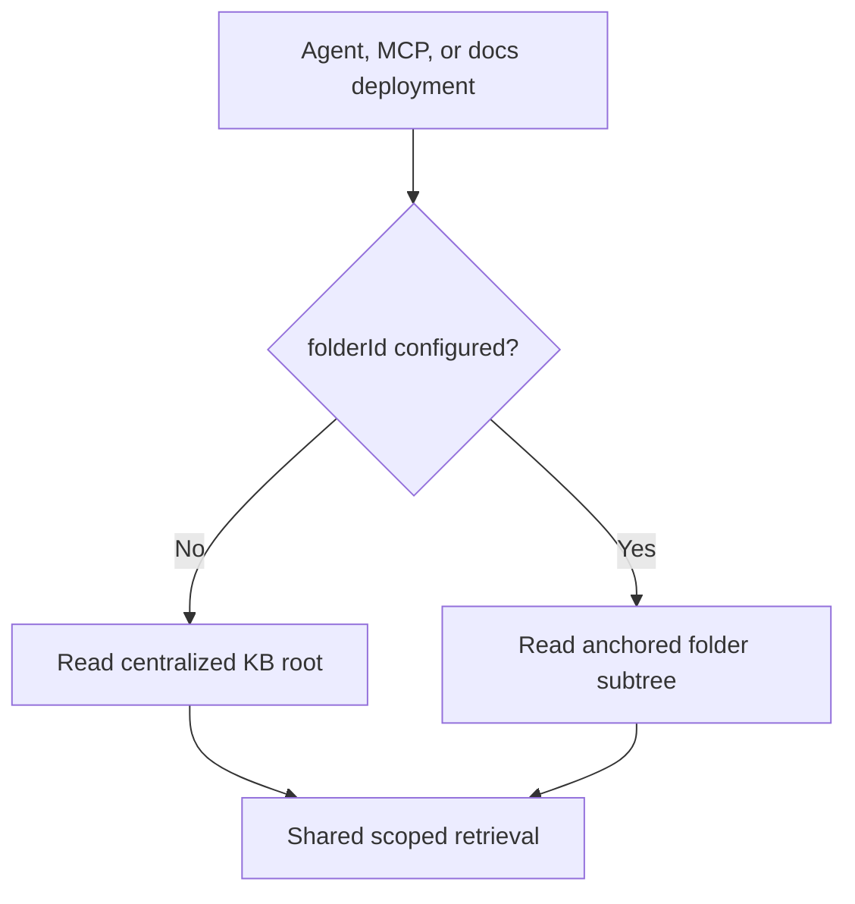
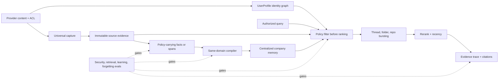

# Company memory foundation

This is the simplified Nimbase architecture after removing projected memory
slices. It deliberately establishes only two foundations now: one canonical
company knowledge base, and one stable profile for each employee. Provider ACL
mirroring is now attached to source evidence; policy-preserving compilation and
the long-term governance model remain the next phase.

## Current product shape

The invariants are intentionally small:

- A captured source is stored once and compiled once.
- OKF markdown in versioned object storage is authoritative; Postgres is the
  derived index.
- Deployments read from the KB root by default.
- `folderId` is an optional deployment anchor, not a memory ownership model.
- Existing folder access checks remain fail-closed until governance is
  redesigned.
- Connector evidence carries an immutable provider ACL. Every provider source
  is held out of compilation for now; restricted evidence additionally requires
  its source-derived identity grants at retrieval.
- This boundary applies to raw provider evidence and new compilation. Memory
  compiled before provider policies existed is not permission-proven; the eval
  phase must trace and audit those derivations before restricted compiled memory
  is enabled.

## Company identity spine

Resolution order is stable provider subject, then exact verified email, then a
new profile. The resolver never uses a person's name, title, or fuzzy matching
as identity evidence. `ExternalIdentity` records provider bindings and
`UserProfileEmail` records verified aliases. Every workspace membership points
to exactly one `UserProfile`.

## Deployment scope

Folder scope is optional at the wire contract, CLI, service, and schema layers.
An omitted `--folder` is represented as `folderId = null` and `folderPath = ""`.
This seam is retained because it can later carry provider ACL and policy
decisions without reintroducing duplicate memory.

## Deliberately deferred

- Group and organization identity synchronization.
- Permission-preserving compilation of restricted evidence and its security
  evals.
- Retrieval evidence traces, thread/project bursting, recency, and reranking.
- Learning, forgetting, retention, and their evaluation framework.

Those capabilities should attach to the canonical source, identity, and
deployment seams above rather than adding another parallel memory model.

## Vision after the security eval foundation

The eval system is a release gate, not an observability afterthought. Restricted
compilation does not ship until fixtures prove non-interference across access
domains, revoked access disappears from retrieval, and every answer can trace
back to evidence the caller can independently read.
